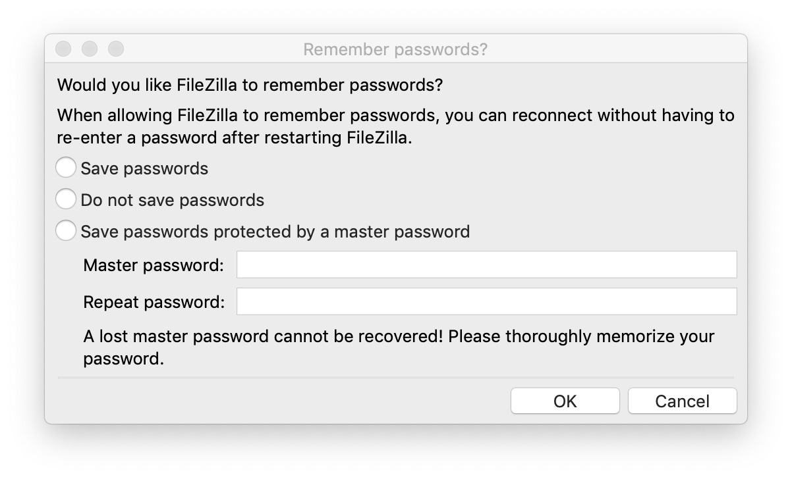
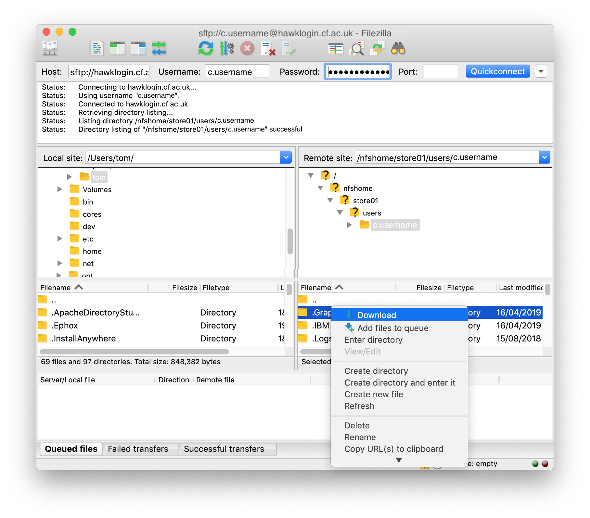
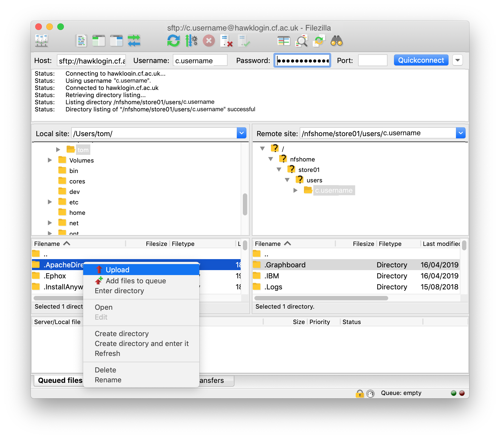
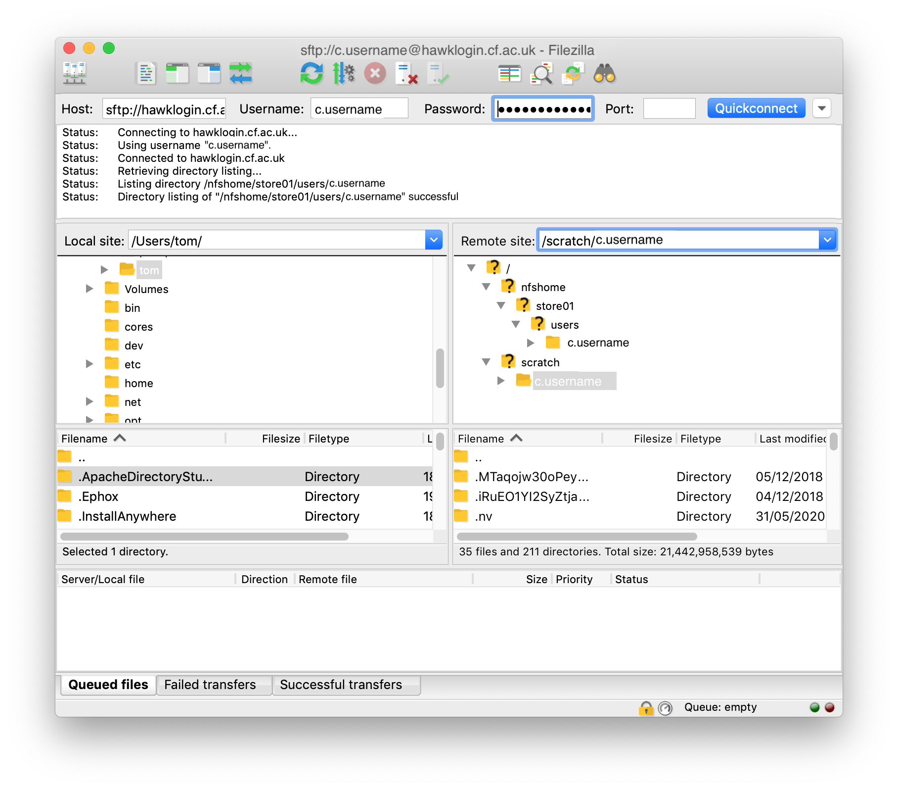

Computing with a remote computer offers very limited use if we cannot get files to 
or from the cluster. There are several options for transferring data between computing 
resources, from command line options to GUI programs, which we will cover here.

## Download files from the internet using wget

One of the most straightforward ways to download files is to use `wget`. Any file 
that can be downloaded in your web browser with an accessible link can be downloaded 
using `wget`. This is a quick way to download datasets or source code. 

The syntax is: `wget https://some/link/to/a/file.tar.gz`. For example, download the 
lesson sample files using the following command:

```
{{ site.host_prompt }} wget {{ site.url }}{{ site.baseurl }}/files/bash-lesson.tar.gz
```
{: .bash}

## Transferring single files and folders with scp

To copy a single file to or from the cluster, we can use `scp`. The syntax can be a little complex
for new users, but we'll break it down here:

To transfer *to* another computer:
```
{{ site.local_prompt }} scp /path/to/local/file.txt yourUsername@remote.computer.address:/path/on/remote/computer
```
{: .bash}

To download *from* another computer:
```
{{ site.local_prompt }} scp yourUsername@remote.computer.address:/path/on/remote/computer/file.txt /path/to/local/
```
{: .bash}

Note that we can simplify doing this by shortening our paths. On the remote computer, everything
after the `:` is relative to our home directory. We can simply just add a `:` and leave it at that
if we don't care where the file goes.

```
{{ site.local_prompt }} scp local-file.txt yourUsername@remote.computer.address:
```
{: .bash}

To recursively copy a directory, we just add the `-r` (recursive) flag:

```
{{ site.local_prompt }} scp -r some-local-folder/ yourUsername@remote.computer.address:target-directory/
```
{: .bash}

> ## A note on rsync
>
> As you gain experience with transferring files, you may find the `scp` command limiting. The
> [rsync](https://rsync.samba.org/) utility provides advanced features for file transfer and is
> typically faster compared to both `scp` and `sftp` (see below). It is especially useful for
> transferring large and/or many files and creating synced backup folders.
>
> The syntax is similar to `scp`. To transfer *to* another computer with commonly used options:
> ```
> [local]$ rsync -avzP /path/to/local/file.txt yourUsername@remote.computer.address:/path/on/remote/computer
> ```
> {: .bash}
>
> The `a` (archive) option preserves file timestamps and permissions among other things; the `v` (verbose)
> option gives verbose output to help monitor the transfer; the `z` (compression) option compresses
> the file during transit to reduce size and transfer time; and the `P` (partial/progress) option
> preserves partially transferred files in case of an interruption and also displays the progress
> of the transfer.
>
> To recursively copy a directory, we can use the same options:
> ```
> [local]$ rsync -avzP /path/to/local/dir yourUsername@remote.computer.address:/path/on/remote/computer
> ```
> {: .bash}
> 
> The `a` (archive) option implies recursion.
> 
> To download a file, we simply change the source and destination:
> ```
> [local]$ rsync -avzP yourUsername@remote.computer.address:/path/on/remote/computer/file.txt /path/to/local/
> ```
> {: .bash}
{: .callout}

## Transferring files interactively with FileZilla (sftp)

FileZilla is a cross-platform client for downloading and uploading files to and from a remote
computer. It is absolutely fool-proof and always works quite well. It uses the `sftp`
protocol. You can read more about using the `sftp` protocol in the command line [here]({{ site.baseurl }}).

Download and install the FileZilla client from
[https://filezilla-project.org](https://filezilla-project.org). After installing and opening the
program, you should end up with a window with a file browser of your local system on the left hand
side of the screen. When you connect to the cluster, your cluster files will appear on the right
hand side.

To connect to the cluster, we'll just need to enter our credentials at the top of the screen:

* Host: `sftp://{{ site.host_login }}` or `sftp://{{ site.host_login2 }}`
* User: Your cluster username
* Password: Your cluster password
* Port: (leave blank to use the default port)

Hit "Quickconnect" to connect! You should see your remote files appear on the right hand side of the
screen. You can drag-and-drop files between the left (local) and right (remote) sides of the screen
to transfer files.

### Copying data from your PC to Supercomputing Wales

You can copy files to/from your Supercomputing Wales home and scratch locations using the secure copy protocol (SCP) or secure file transfer protocol (SFTP) and connecting to Hawk. 

Open filezilla and type ```sftp://hawklogin.cf.ac.uk``` or ```sftp://sunbird.swansea.ac.uk``` into the host box. Enter your username and password in the username/password boxes.


First time you will need to select how to manage passwords.  This is a personal preference but safest approach would be
to select "Do not save passwords".



Click Quickconnect and a connection will be started. The first time you connect you will be asked to verify the host key, tick the "Always trust this host, add key to the cache" box to stop this message appearing again in future.


You should now have some files in the right hand side of the window. These are on the remote system, the list on the left hand side is your local system.


Files can be transferred either by dragging and dropping them from one side to the other. Or you can right click on a remote file and choose "Download" or a local file and choose "Upload". 




You can change directory on the remote host by typing a path into the "Remote site:" box. For example type in ```/scratch/user.name``` (where user.name is your username) to access your scratch directory. 



Other applications are available such as WinSCP.

## Archiving files

One of the biggest challenges we often face when transferring data between remote HPC systems
is that of large numbers of files. There is an overhead to transferring each individual file 
and when we are transferring large numbers of files these overheads combine to slow down our
transfers to a large degree.

The solution to this problem is to *archive* multiple files into smaller numbers of larger files
before we transfer the data to improve our transfer efficiency. Sometimes we will combine 
archiving with *compression* to reduce the amount of data we have to transfer and so speed up
the transfer.

The most common archiving command you will use on (Linux) HPC cluster is `tar`. `tar` can be used
to combine files into a single archive file and, optionally, compress. For example, to collect
all files contained inside `output_data` into an archive file called `output_data.tar` we would use:

```
{{ site.local_prompt }} tar -cvf output_data.tar output_data/
```
{: .bash}

The options we used for `tar` are:

- `-c` - Create new archive
- `-v` - Verbose (print what you are doing!)
- `-f mydata.tar` - Create the archive in file *output_data.tar*

The tar command allows users to concatenate flags. Instead of typing `tar -c -v -f`, we can use `tar -cvf`. We can also use the `tar` command to extract the files from the archive once we have transferred it:

```
{{ site.local_prompt }} tar -xvf output_data.tar
```
{: .bash}

This will put the data into a directory called `output_data`. Be careful, it will overwrite data there if this
directory already exists!

Sometimes you may also want to compress the archive to save space and speed up the transfer. However,
you should be aware that for large amounts of data compressing and un-compressing can take longer
than transferring the un-compressed data  so you may not want to transfer. To create a compressed
archive using `tar` we add the `-z` option and add the `.gz` extension to the file to indicate
it is compressed, e.g.:

```
{{ site.local_prompt }} tar -czvf output_data.tar.gz output_data/
```
{: .bash}

The `tar` command is used to extract the files from the archive in exactly the same way as for
uncompressed data as `tar` recognizes it is compressed and un-compresses and extracts at the 
same time:

```
{{ site.local_prompt }} tar -xvf output_data.tar.gz
```
{: .bash}

> ## Transferring files.
> 1. Login to a login node.
> 2. Create a file called hello.txt by using the nano text editor (or the editor of your choice) and typing `nano hello.txt`. Enter some text into the file and press Ctrl+X to save it. 
> 3. Use either Filezilla or SCP/SFTP to copy the file to your computer. 
> 4. Create a file on your computer using a text editor. Copy that file to your Supercomputing Wales home directory using Filezilla or SCP/SFTP and examine its conents with `nano` on the login node. 
{: .challenge}

> ## Working with Windows
>
> When you transfer files to from a Windows system to a Unix system (Mac, Linux, BSD, Solaris, etc.)
> this can cause problems. Windows encodes its files slightly different than Unix, and adds an extra
> character to every line.
> 
> On a Unix system, every line in a file ends with a `\n` (newline). On Windows, every line in a
> file ends with a `\r\n` (carriage return + newline). This causes problems sometimes.
> 
> Though most modern programming languages and software handles this correctly, in some rare
> instances, you may run into an issue. The solution is to convert a file from Windows to Unix
> encoding with the `dos2unix` command.
> 
> You can identify if a file has Windows line endings with `cat -A filename`. A file with Windows
> line endings will have `^M$` at the end of every line. A file with Unix line endings will have `$`
> at the end of a line.
> 
> To convert the file, just run `dos2unix filename`. (Conversely, to convert back to Windows format,
> you can run `unix2dos filename`.)
{: .callout}

> ## A note on ports
>
> All file transfers using the above methods use encrypted communication over port 22. This is the
> same connection method used by SSH. In fact, all file transfers using these methods occur through
> an SSH connection. If you can connect via SSH over the normal port, you will be able to transfer
> files.
{: .callout}


